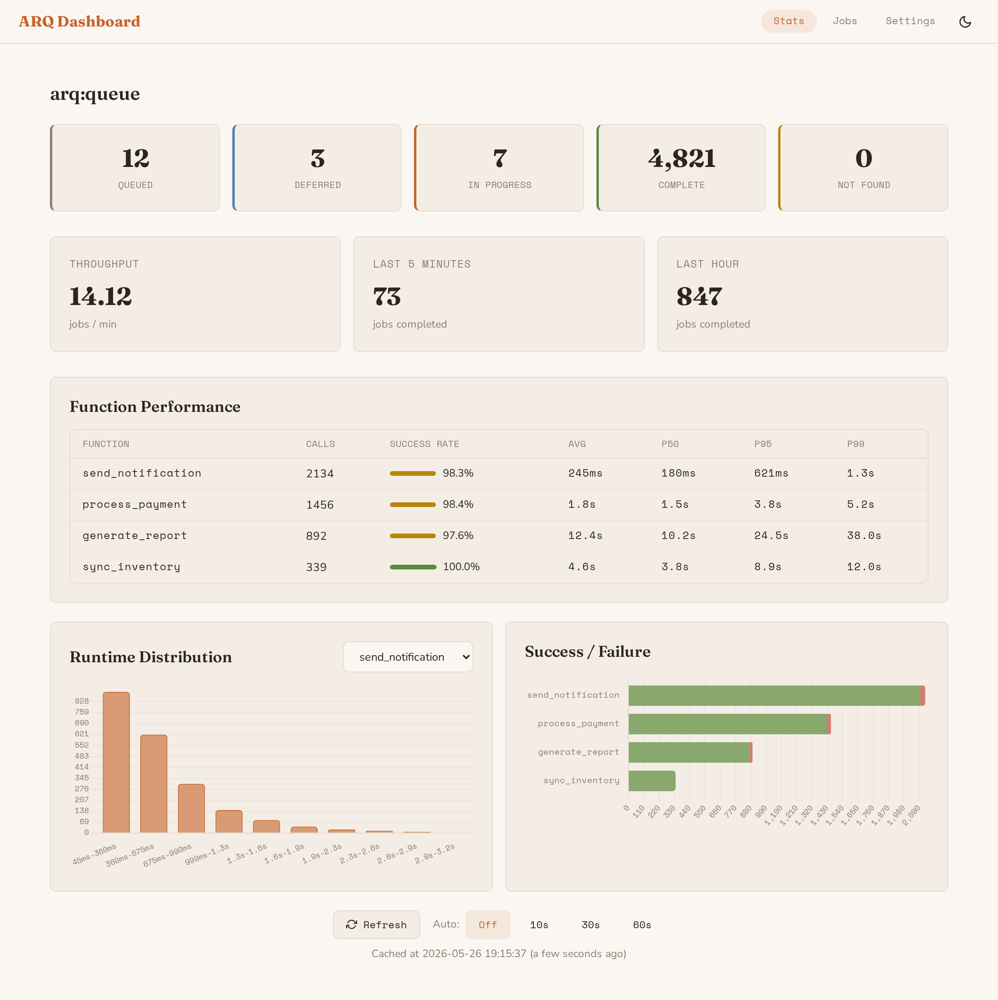
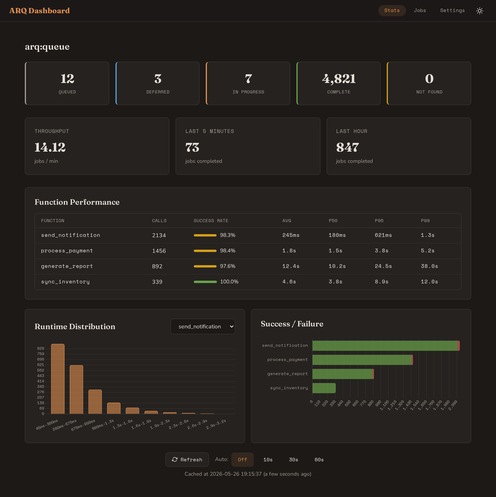
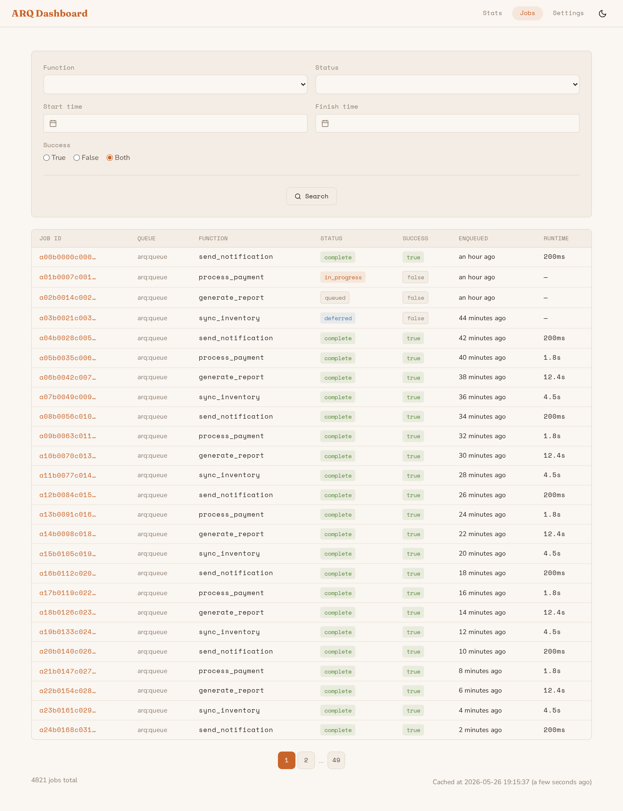
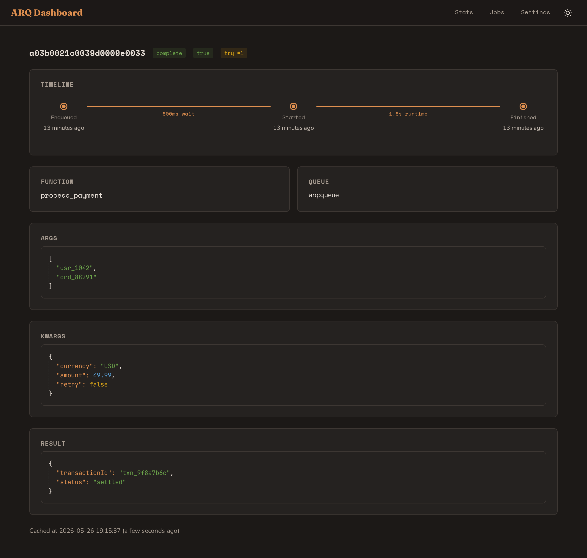
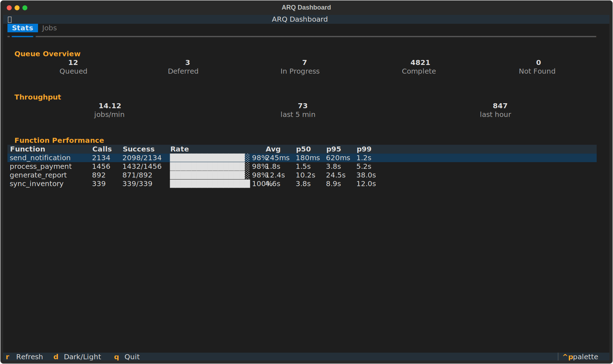
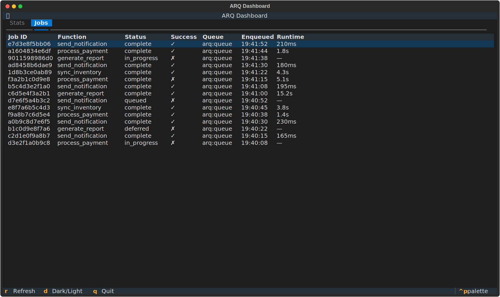
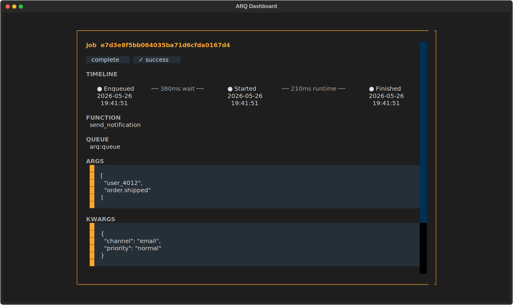

# arq-dashboard

A monitoring dashboard for [ARQ](https://github.com/samuelcolvin/arq) (async Redis job queue).

## Quick start

```bash
docker run --rm -p 8000:8000 \
  -e ARQ_DASHBOARD_REDIS_URL=redis://your-redis:6379 \
  ghcr.io/srijanpatel/arq-dashboard:latest
```

Open `http://localhost:8000`. Or launch the TUI:

```bash
docker run --rm -it \
  -e ARQ_DASHBOARD_REDIS_URL=redis://your-redis:6379 \
  ghcr.io/srijanpatel/arq-dashboard tui
```





## Features

- Queue overview — queued, in-progress, deferred, complete job counts
- Function performance — success rates, runtime percentiles (p50/p95/p99)
- Runtime distribution charts and success/failure breakdown
- Throughput metrics — jobs/min, last 5 minutes, last hour
- Auto-refresh (10s / 30s / 60s)
- Job list with filtering by function, status, time range
- Job detail with visual enqueue → start → finish timeline
- Dark / light mode with system preference detection
- Terminal UI (`arq-dashboard tui`) — same data, no browser needed





### Terminal UI







## Configuration

| Variable | Default | Description |
|----------|---------|-------------|
| `ARQ_DASHBOARD_REDIS_URL` | `redis://localhost:6379` | Redis connection URL |
| `ARQ_DASHBOARD_CACHE_TTL` | `60` | API cache TTL in seconds |
| `ARQ_DASHBOARD_DEBUG` | `false` | Debug mode |
| `ARQ_DASHBOARD_LOG_LEVEL` | `DEBUG` | Log level |

## Development

Requires Python 3.11+, Node.js 18+, Redis, and [uv](https://docs.astral.sh/uv/).

```bash
make install        # Install all dependencies
make dev-backend    # Backend on :8000
make dev-frontend   # Frontend on :5173 (proxies to backend)
make test           # Run all tests
make lint           # Lint all code
```

## License

MIT

---

Forked from [ninoseki/arq-dashboard](https://github.com/ninoseki/arq-dashboard) and [ninoseki/arq-dashboard-frontend](https://github.com/ninoseki/arq-dashboard-frontend) by [@ninoseki](https://github.com/ninoseki).
